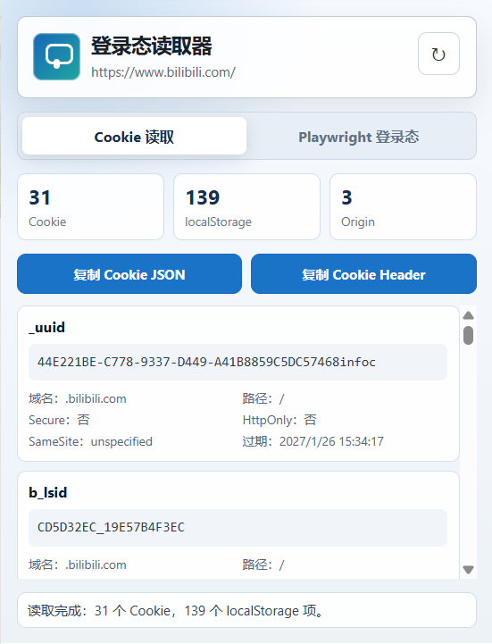
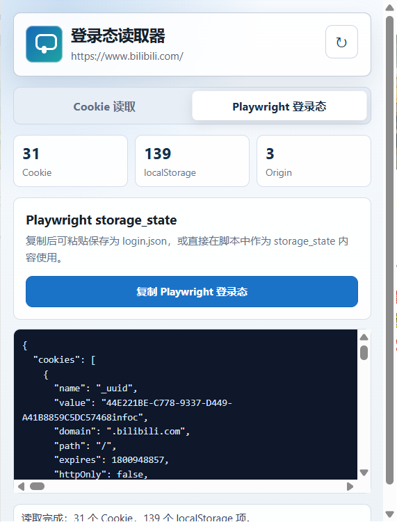

# 登录态读取器

> Chrome / Edge 插件 + Python 桌面桥接工具，用于读取网页 Cookie、Cookie Header 和 Playwright 登录态。


登录态读取器面向本地开发、自动化测试、爬虫调试和 Playwright 调试场景。它可以在真实浏览器环境中读取当前页面的 Cookie 和 localStorage，并把结果转换为 Cookie JSON、Cookie Header 或 Playwright `storage_state`。

适合常见平台登录态调试，例如：

- B站 / 哔哩哔哩 / bilibili
- 腾讯视频 / v.qq.com
- 小红书 / xiaohongshu
- 知乎、微博、抖音、其他需要真实浏览器登录态的网站


## 功能特性

- **Cookie JSON**：读取目标页面及相关域名 Cookie。
- **Cookie Header**：生成可直接用于 HTTP 请求的 `Cookie` 请求头。
- **Playwright 登录态**：生成 `storage_state` 兼容数据，包含 cookies 和 localStorage。
- **真实浏览器环境**：复用用户已登录的 Chrome / Edge profile。
- **桌面应用通信**：插件通过 `ws://127.0.0.1:17891` 与本地 Python 程序通信。
- **脚本控制插件**：Python 传入 URL 和读取模式，插件自动打开页面、读取数据、返回结果。
- **自动启动浏览器**：浏览器未打开时，桌面端可自动启动 Chrome / Edge。
- **自动清理标签页**：默认关闭插件为本次读取新建的目标标签页。

## 项目结构

```text
comment_cli/
├─ extension/              # 浏览器插件源码，加载这个目录
│  ├─ manifest.json
│  ├─ background.js
│  ├─ popup.html
│  ├─ popup.css
│  ├─ popup.js
│  └─ icons/
├─ desktop/                # Python 桌面桥接 SDK
│  ├─ getSession.py
│  └─ main.py
├─ docs/images/            # 截图素材
│  ├─ cookie.png
│  └─ playwright.png
├─ requirements.txt
├─ LICENSE
└─ README.md
```

## 快速开始

### 1. 安装 Python 依赖

```bash
pip install -r requirements.txt
```

### 2. 加载浏览器插件

打开 Chrome 或 Edge：

```text
chrome://extensions/
```

然后：

1. 开启右上角“开发者模式”。
2. 点击“加载已解压的扩展程序”。
3. 选择项目里的 `extension/` 目录。

注意：不要选择项目根目录，必须选择 `extension/`。

### 3. 运行桌面示例

```bash
python -B desktop/main.py
```

默认示例会读取 B站 Cookie JSON：

```python
from getSession import get_cookie_json

cookies = get_cookie_json("https://www.bilibili.com/")
print(cookies)
```

`-B` 用于避免 Python 生成 `__pycache__`，防止你误把缓存目录放进扩展目录。

## Python 用法

### 获取 Cookie JSON

```python
from getSession import get_cookie_json

cookies = get_cookie_json("https://www.bilibili.com/")
```

### 获取 Cookie Header

适合配合 `requests`、`httpx` 等库使用：

```python
from getSession import get_cookie_header

header = get_cookie_header("https://www.bilibili.com/")
headers = {"Cookie": header}
```

### 获取 Playwright 登录态

适合腾讯视频、小红书、B站这类依赖登录态的平台调试：

```python
from getSession import get_playwright_storage_state

state = get_playwright_storage_state("https://v.qq.com/")
```

Playwright 中使用：

```python
from playwright.sync_api import sync_playwright

with sync_playwright() as p:
    browser = p.chromium.launch(channel="chrome", headless=False)
    context = browser.new_context(storage_state=state)
    page = context.new_page()
    page.goto("https://v.qq.com/")
```

### 一次返回全部信息

```python
from getSession import get_session

payload = get_session("https://www.xiaohongshu.com/", "all")

print(payload["cookies"])
print(payload["header"])
print(payload["playwright"])
```

## 常见平台示例

### B站 / 哔哩哔哩

```python
from getSession import get_cookie_header

header = get_cookie_header("https://www.bilibili.com/")
print(header)
```

适合读取 B站 Cookie Header，用于本地请求调试。

### 腾讯视频

```python
from getSession import get_playwright_storage_state

state = get_playwright_storage_state("https://v.qq.com/")
print(state)
```

腾讯视频通常不仅依赖 Cookie，也可能依赖 localStorage 和真实浏览器环境，因此更推荐使用 Playwright 登录态模式。

### 小红书

```python
from getSession import get_session

payload = get_session("https://www.xiaohongshu.com/", "all")
print(payload["playwright"])
```

小红书风控较强，建议先在真实浏览器中手动确认已登录，再运行脚本读取登录态。

## 桌面通信协议

插件后台会自动尝试连接：

```text
ws://127.0.0.1:17891
```

桌面程序发送 JSON：

```json
{
  "id": "req-1",
  "action": "get_login_state",
  "url": "https://www.bilibili.com/",
  "mode": "all",
  "activate": true,
  "timeoutMs": 12000,
  "closeTabAfter": "created",
  "reuseExistingTab": false
}
```

插件返回：

```json
{
  "id": "req-1",
  "type": "response",
  "action": "get_login_state",
  "ok": true,
  "payload": {
    "cookies": [],
    "header": "",
    "playwright": {
      "cookies": [],
      "origins": []
    }
  },
  "error": "",
  "sentAt": "2026-05-24T00:00:00.000Z"
}
```

`mode` 支持：

- `cookies`：返回 Cookie JSON。
- `header`：返回 Cookie Header。
- `playwright`：返回 Playwright `storage_state`。
- `all`：返回全部内容。

## 插件界面

Cookie 模式：



Playwright 模式：



## 注意事项

- 本项目依赖真实浏览器插件，不推荐用 headless 浏览器加载插件。
- 推荐流程是：有界面浏览器读取登录态，后续 Playwright 可尝试 headless 使用 `storage_state`。
- 插件不会把 Cookie 或 localStorage 上传到远程服务器。
- 本地通信只连接 `127.0.0.1:17891`。
- 如果平台风控较强，完整 Chrome profile 仍可能比可迁移的 `storage_state` 更稳定。

## 故障排查

### 插件没有连接 Python

1. 确认浏览器已加载 `extension/` 目录。
2. 修改插件后，在扩展管理页点击“重新加载”。
3. 确认 Python 端正在运行。
4. 等待几秒，Manifest V3 后台 Service Worker 会由 `alarms` 定期唤醒重连。

### Chrome 提示不能加载 `__pycache__`

不要把 Python 文件放进扩展目录。浏览器只加载 `extension/` 目录。

运行 Python 示例时建议使用：

```bash
python -B desktop/main.py
```

### 页面打开后又关闭

默认 `close_tab_after="created"`，插件会关闭本次新建的目标标签页。需要保留页面时：

```python
payload = get_session("https://www.bilibili.com/", "all", close_tab_after="never")
```

## 许可证

MIT License
